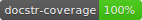

# Precision Toxicology Metadata Manager

[](https://github.com/precisiontox/ptox-metadata-manager/actions/workflows/build.yml)
[](https://coveralls.io/github/precisiontox/ptox-metadata-manager?branch=terazus-badges)
[](https://www.codacy.com/gh/precisiontox/ptox-metadata-manager/dashboard?utm_source=github.com&amp;utm_medium=referral&amp;utm_content=precisiontox/ptox-metadata-manager&amp;utm_campaign=Badge_Grade)


[](https://pretox-metadata-manager.readthedocs.io/en/latest/?badge=latest)


## Introduction
The precision toxicology metadata manager is a tool to manage metadata for the precision toxicology project. 
It is a web application that allows users to create study designs from a very simple form and generates a metadata
excel stub saved in Google Drive. This repository contains the source code for the API.


## Getting started
### Requirements:
-  Python 3.9 or newer
-  A Google Cloud Platform account with the Google Drive API and GMail API enabled.
-  An SQL database running. Tested with SQLite.

### Setup:
Clone and install the dependencies in a virtual environment:
```shell
git clone https://github.com/precisiontox/ptox-metadata-manager.git
cd ptox-metadata-manager
python -m venv venv
source venv/bin/activate
pip install -r requirements.txt # for production
pip install -r requirements-dev.txt # for development
```

Before running the application you need to obtain a Google Drive ID and secret: head to your Google Cloud console and 
enable the <b>Google Drive API</b> and the <b>Gmail API</b>. Then, go to `API & Services > Credentials` and create a new OAuth client 
ID using the `Desktop Application` option. Once done, you will be presented with a client ID and a client secret you
will want to copy.
Inside the `ptmd/resources/` directory, rename `.env.example` to `.env` and fill in the values for your environment.
```text
# Parameters for the Flask app
SQLALCHEMY_DATABASE_URL=sqlite:///:memory:
SQLALCHEMY_SECRET_KEY=A_SUPER_SECRET_KEY_TO_ENCODE_PASSWORDS
SITE_URL=http://localhost:5000

# Parameters for the Google Drive API
GOOGLE_DRIVE_CLIENT_ID=Your_google_api_id
GOOGLE_DRIVE_CLIENT_SECRET=Your_google_api_secret
GOOGLE_DRIVE_CREDENTIALS_FILEPATH=Absolute_path_to_google_drive_credentials_file
GOOGLE_DRIVE_SETTINGS_FILEPATH=Absolute_path_to_google_drive_settings_file

# Parameters for the default admin account
ADMIN_EMAIL=your@email.com
ADMIN_USERNAME=admin
ADMIN_PASSWORD=admin
```

The environment variables are divided into three categories:
- The Flask applications configuration variables:
  - `SQLALCHEMY_DATABASE_URL`: this is the URL to your database. You can use sqlite, postgres, mysql, etc., e.g.
    sqlite:///ptmd.db, and will need to change this before running the application.
  - `SQLALCHEMY_SECRET_KEY`: this is the secret key used to encrypt hashes and other sensitive data.
  - `SITE_URL`: the URL of the site.
- The Google Drive API configuration variables:
  - `GOOGLE_DRIVE_CLIENT_ID`: the Google Drive client ID obtainable in your Google Cloud Console (see above).
  - `GOOGLE_DRIVE_CLIENT_SECRET`: the Google Drive client secret obtaining in your Google Cloud Console (see above).
  - `GOOGLE_DRIVE_CREDENTIALS_FILEPATH`: the path where to store the credentials file created during first boot. This needs to 
    be a json file (e.g. credentials.json).
  - `GOOGLE_DRIVE_SETTINGS_FILEPATH`: the path where to store the settings file created during first seed_db 
    e.g. settings.yaml) Not that a `.yml` extension <b>will not be accepted</b>, please use `.yaml` instead.
- The admin account configuration variables.
  - `ADMIN_EMAIL`: the email address of the admin user. This is used to send emails to the admin user when a new user
    registers.
  - `ADMIN_USERNAME`: the username of the admin user. This is used to create the first admin user. Cannot be changed.
  - `ADMIN_PASSWORD`: the password of the admin user. This is used to create the first admin user. Can be changed later.

You can now run the following command and accept the application in your browser. This is done once only during first seed_db.
It will download the Google API credentials file and generate the database once you are done.
Finally, it will seed_db the flask API.
```shell
python -m app
```

Once the API is booted go to http://localhost:5000/apidocs to see the Swagger documentation.

## Testing
You will need the development dependencies installed to run the tests.
```shell
coverage run -m unittest discover -s tests/
coverage report -m
```


## Verify and generate the documentation
You will need the development dependencies installed to generate the documentation.
For Unix based systems:
```shell
docstr-coverage ptmd/ --fail-under=100
cd docs
make html
```

For Windows:
```shell
docstr-coverage ptmd/ --fail-under=100
.\docs\make.bat html
```


## Verify type hints
You will need the development dependencies installed to verify the type hints.
```shell
mypy --install-types
mypy .\ptmd --disallow-untyped-calls  --disallow-incomplete-defs --follow-imports=skip  --check-untyped-defs
```


## Authors:
-  [B. Dominique](https://github.com/terazus), University of Oxford.