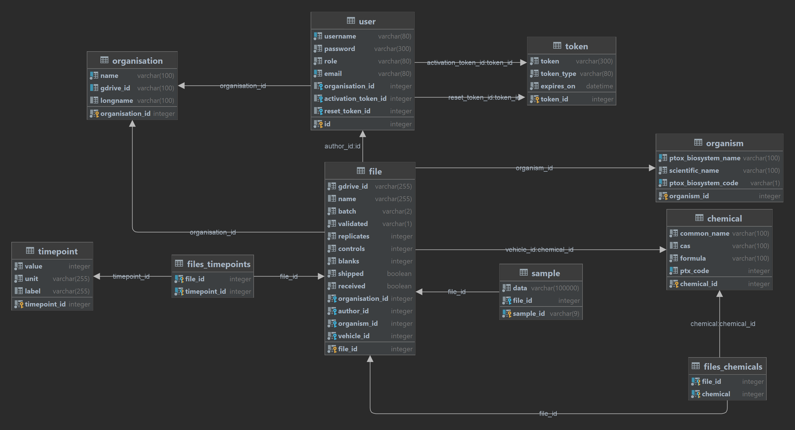

<h1 style="text-align: center">Precision Toxicology Metadata Manager</h1>

<p align="center">
  <a href="https://github.com/precisiontox/ptox-metadata-manager/actions/workflows/build.yml" target="_blank" rel="noopener noreferrer">
     
  </a>
  <a href="https://coveralls.io/github/precisiontox/ptox-metadata-manager?branch=main" target="_blank" rel="noopener noreferrer">
     
  </a>
  <a href="https://app.codacy.com/gh/precisiontox/ptox-metadata-manager/dashboard?utm_source=gh&utm_medium=referral&utm_content=&utm_campaign=Badge_grade">
    
  </a>
  <a>
   
  </a>
  <a href="https://raw.githubusercontent.com/precisiontox/ptox-metadata-manager/main/docs_badge.svg" target="_blank" rel="noopener noreferrer">
    
  </a>
  <a href="https://pretox-metadata-manager.readthedocs.io/en/latest/?badge=latest" target="_blank" rel="noopener noreferrer">
    
  </a>
  <a href="https://github.com/precisiontox/ptox-metadata-manager/actions/workflows/mypy.yml" target="_blank" rel="noopener noreferrer">
    
  </a>
  <a href="https://raw.githubusercontent.com/precisiontox/ptox-metadata-manager/main/LICENCE" target="_blank" rel="noopener noreferrer">
    
  </a>
  <a href="https://pretox.isa-tools.org/apidocs/" target="_blank" rel="noopener noreferrer">
    
  </a>
</p>


## Introduction
<p align="center">
  <a href="https://www.youtube.com/watch?v=XWItfWplwT0&hd=1">
    
  </a>
</p>

### Objectives
The precision toxicology metadata manager is a tool created to help the consortium partners producing 
data to create, find, validate and share metadata about samples they collect in the lab. The idea behind the tool is to 
operate before the sample are exposed to specific compounds and are then collected. These samples are meant to be shipped
to a central partner who splits them for *RNAseq* and *mass-spectrometry*. The tool ensures that metadata do not contain 
any error, can be used to find physical samples in the shipped boxes and that the experimental results can be produced in
a FAIR and publishable way.
<br>
Users producing samples are invited to fill a form based on an experimental design defined by the consortium. 
It generates Excel files containing the metadata about sample exposition and collection divided into
two sheets:
- a first sheet containing specific information about the samples. This includes which replicates are exposed 
to which compound, at which dose and after how long they were collected, as well as unique identifiers for each sample.
- a second sheet containing general information about the experiment, like the organisation, the species, the start 
and end date, etc.

The spreadsheets are then uploaded to a shared Google Drive folder and opened for editing for when users hit the lab. The 
tool keeps track of the files uploaded to Google Drive, can import external files, and validates the 
content of the spreadsheets. This validation steps are mandatory before the files and boxes can be shipped.
<br>
Once marked as shipped, the file is locked and cannot be edited anymore. Users from the receiving partner can then mark the
file as received and generate a standardised version of the file using the ISA-JSON format. This file can be imported 
into the ISA-tools suite, merged with metadata from metabolomics and transcriptomics, and deposited to public repositories 
such as ``MetaboLights`` and ``ArrayExpress``. Finally, the samples are registered in the database
and exposed through a REST endpoint. This allows users to search them and retrieve their metadata through both
programmatic and web interfaces.


### Components:

#### The Backend API
It is hosted in this repository. It contains a Flask application exposing a REST API and is plugged to a relational
database through SQLAlchemy. It is responsible for authentication, all functionalities logic and the persistence of 
(meta)-data. It provides a Swagger documentation accessible at https://pretox.isa-tools.org/apidocs. The documentation 
describes the API usage and provides a way to run queries through a web UI. The code is documented using ``docstrings`` 
and the documentation is available on ``readthedocs``. The application is entirely unit-tested, typehints are checked 
with ``mypy``, code quality is surveyed by ``Codacy`` and styles are enforced by ``flake8``, all as part of  the 
continuous integration pipeline.
<br> <br>
The application source code is contained in the ``ptmd`` directory and divided as such:
- The ``api`` directory contains the flask application exposing the REST API. It includes routes definitions, the 
  JSON Web Token authentication logic and the validation of user inputs through JSON Schema.
- The ``boot`` directory contains the code responsible for booting the application, like seeding the initial data into 
the database.
- The ``const`` directory contains the constants used throughout the application.
- The ``database`` directory contains the database models and complex queries. Interactions with the database is mostly
defined as methods of the model classes.
- The ``lib`` directory contains the code responsible for the business logic, like the interactions with the spreadsheets
and the Google Drive API, sending emails and generating ISA-JSON files.
- The ``resources`` directory contains the assets used by the application, like JSON schemas, swagger yaml files, data
files for organisations and chemicals, etc.

Tests are contained in the ``tests`` directory and divided mirroring the application exact structure. They require no 
data files and no interaction with the database to be executed.

#### The frontend client
A NuxtJS web application accessible at https://ptmm.netlify.app. It is responsible for the user interface and the
communication with the API.


## Getting started
### Requirements:
-  Python 3.9 or newer
-  A Google Cloud Platform account with the Google Drive API and GMail API enabled.
-  An SQL database running. Tested with SQLite.

### Setup:
Clone and install the dependencies in a virtual environment:
```shell
git clone https://github.com/precisiontox/ptox-metadata-manager.git
cd ptox-metadata-manager
python -m venv venv
source venv/bin/activate
pip install -r requirements.txt # for production
pip install -r requirements-dev.txt # for development
```

Before running the application you need to obtain a Google Drive ID and secret: head to your Google Cloud console and 
enable the <b>Google Drive API</b> and the <b>Gmail API</b>. Then, go to `API & Services > Credentials` and create a new OAuth client 
ID using the `Desktop Application` option. Once done, you will be presented with a client ID and a client secret you
will want to copy.
Inside the `ptmd/resources/` directory, rename `.env.example` to `.env` and fill in the values for your environment.
```text
# Parameters for the Flask app
SQLALCHEMY_DATABASE_URL=sqlite:///:memory:
SQLALCHEMY_SECRET_KEY=A_SUPER_SECRET_KEY_TO_ENCODE_PASSWORDS
SITE_URL=http://localhost:5000

# Parameters for the Google Drive API
GOOGLE_DRIVE_CLIENT_ID=Your_google_api_id
GOOGLE_DRIVE_CLIENT_SECRET=Your_google_api_secret
GOOGLE_DRIVE_CREDENTIALS_FILEPATH=Absolute_path_to_google_drive_credentials_file
GOOGLE_DRIVE_SETTINGS_FILEPATH=Absolute_path_to_google_drive_settings_file

# Parameters for the default admin account
ADMIN_EMAIL=your@email.com
ADMIN_USERNAME=admin
ADMIN_PASSWORD=admin
```

The environment variables are divided into three categories:
- The Flask applications configuration variables:
  - `SQLALCHEMY_DATABASE_URL`: this is the URL to your database. You can use sqlite, postgres, mysql, etc., e.g.
    sqlite:///ptmd.db, and will need to change this before running the application.
  - `SQLALCHEMY_SECRET_KEY`: this is the secret key used to encrypt hashes and other sensitive data.
  - `SITE_URL`: the URL of the site.
- The Google Drive API configuration variables:
  - `GOOGLE_DRIVE_CLIENT_ID`: the Google Drive client ID obtainable in your Google Cloud Console (see above).
  - `GOOGLE_DRIVE_CLIENT_SECRET`: the Google Drive client secret obtaining in your Google Cloud Console (see above).
  - `GOOGLE_DRIVE_CREDENTIALS_FILEPATH`: the path where to store the credentials file created during first boot. This needs to 
    be a json file (e.g. credentials.json).
  - `GOOGLE_DRIVE_SETTINGS_FILEPATH`: the path where to store the settings file created during first seed_db 
    e.g. settings.yaml) Not that a `.yml` extension <b>will not be accepted</b>, please use `.yaml` instead.
- The admin account configuration variables.
  - `ADMIN_EMAIL`: the email address of the admin user. This is used to send emails to the admin user when a new user
    registers.
  - `ADMIN_USERNAME`: the username of the admin user. This is used to create the first admin user. Cannot be changed.
  - `ADMIN_PASSWORD`: the password of the admin user. This is used to create the first admin user. Can be changed later.

You can now run the following command and accept the application in your browser. This is done once only during first seed_db.
It will download the Google API credentials file and generate the database once you are done.
Finally, it will seed_db the flask API.
```shell
python -m app
```

Once the API is booted go to http://localhost:5000/apidocs to see the Swagger documentation.

## Database schema



## Development

### Testing
You will need the development dependencies installed to run the tests.
```shell
coverage run -m unittest discover -s tests/
coverage report -m
```


### Verify and generate the documentation
You will need the development dependencies installed to generate the documentation.
For Unix based systems:
```shell
docstr-coverage ptmd/ --fail-under=100
cd docs
make html
```

For Windows:
```shell
docstr-coverage ptmd/ --fail-under=100
.\docs\make.bat html
```


### Verify type hints
You will need the development dependencies installed to verify the type hints.
```shell
mypy --config-file=./mypy.ini
```


## Authors:
-  [B. Dominique](https://github.com/terazus), University of Oxford (orcid: [0000-0002-2109-489X](https://orcid.org/0000-0002-2109-489X))
